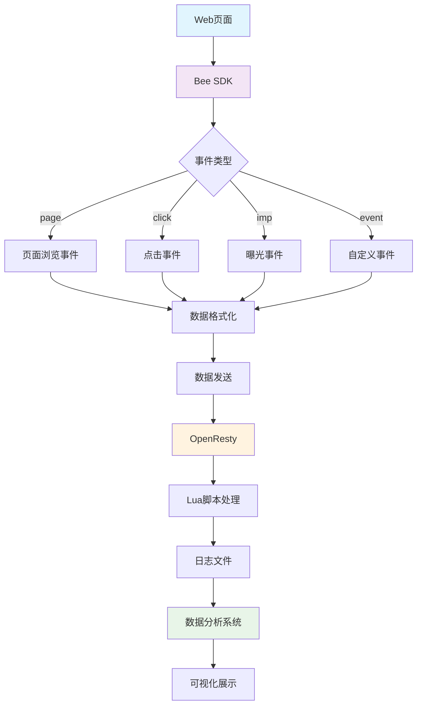
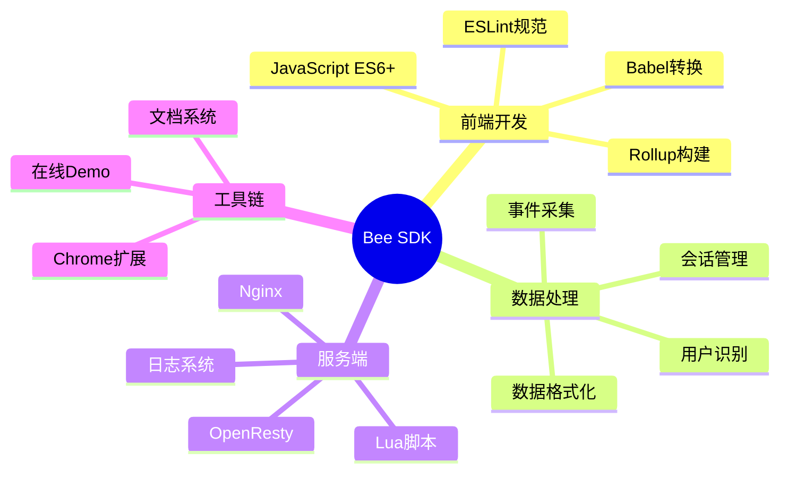
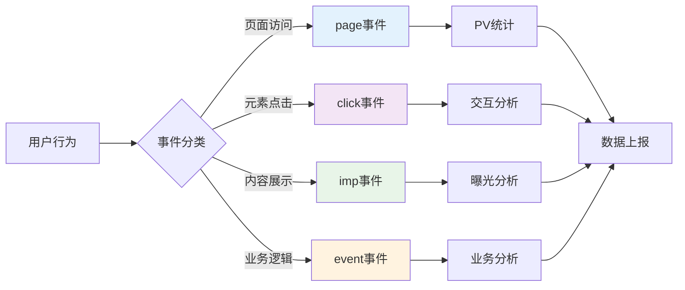
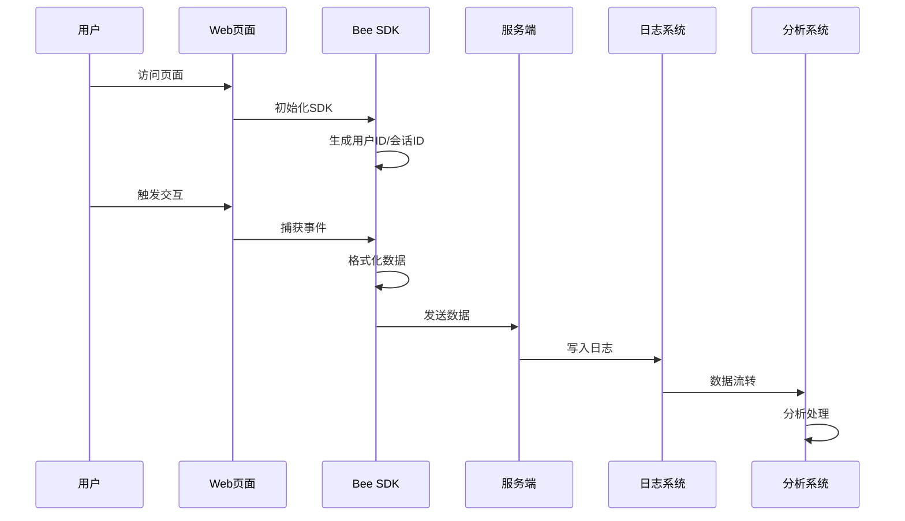
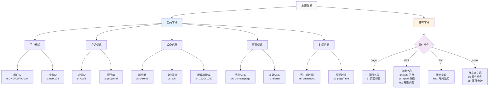
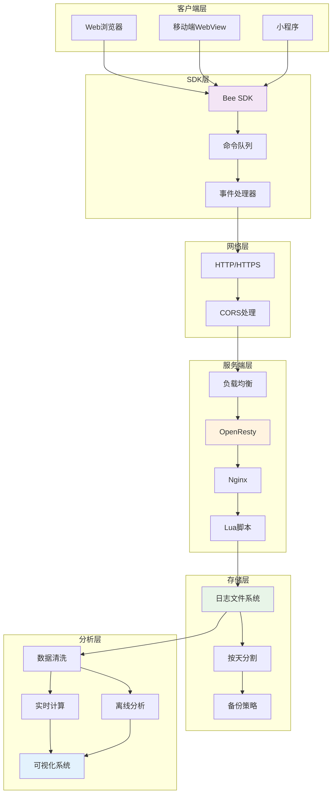
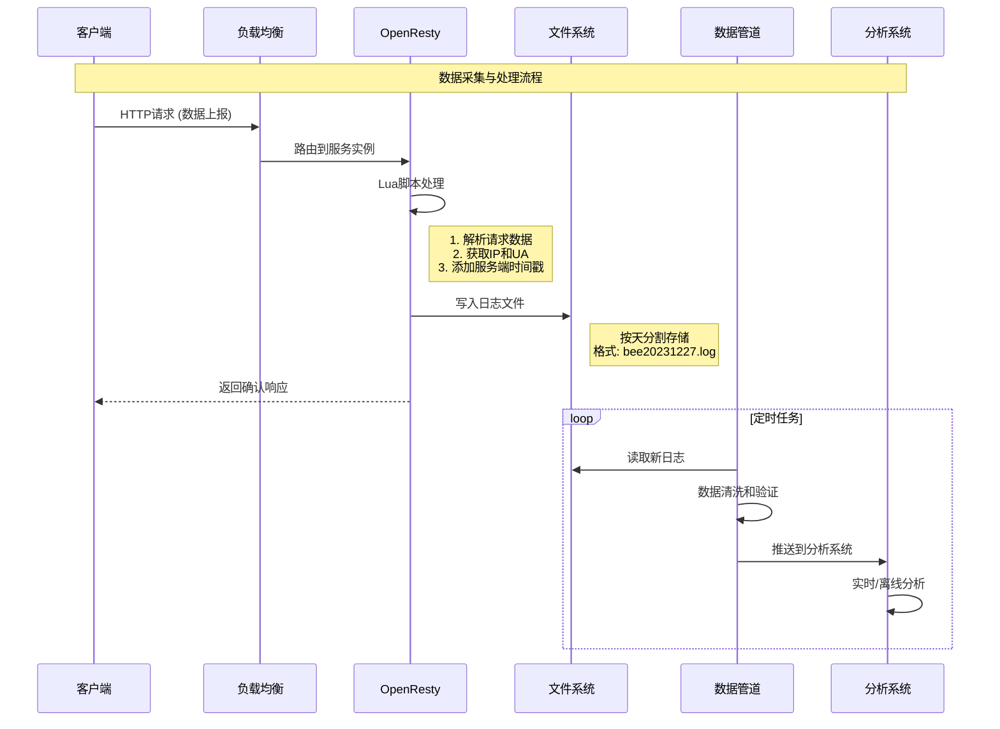
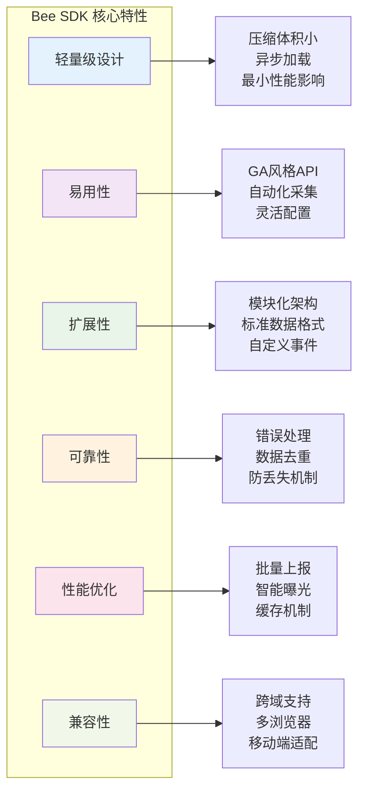

# Bee Web数据采集系统 - 项目总结文档

## 项目概述

**Bee** 是一个轻量级的Web数据采集SDK，专门用于网页埋点和用户行为数据收集。该项目模仿Google Analytics的设计理念，提供了完整的前端数据采集和后端接收处理方案。

- **项目名称**: Bee Web数据采集系统
- **版本**: 0.0.1
- **作者**: jiangzhen
- **项目状态**: 施工中（代码和文档不完善）
- **Github**: https://github.com/zjiang121143210/bee

### 系统整体架构图



## 技术栈

### 前端SDK
- **核心语言**: JavaScript (ES6+)
- **构建工具**: Rollup
- **代码转换**: Babel
- **代码压缩**: Uglify
- **代码规范**: ESLint (Airbnb规范)

### 服务端
- **服务器**: OpenResty (Nginx + Lua)
- **日志处理**: 按天分割的日志文件系统

### 技术栈组成图



### 依赖管理
```json
{
  "构建依赖": [
    "rollup",
    "@babel/core", 
    "@babel/preset-env",
    "rollup-plugin-babel",
    "rollup-plugin-uglify"
  ],
  "开发依赖": [
    "eslint",
    "eslint-config-airbnb"
  ]
}
```

## 项目架构

### 目录结构
```
├── src/                    # 前端SDK源码
│   ├── index.js           # 主入口文件
│   ├── bee-core.js        # 核心功能模块
│   ├── bee-data.js        # 数据处理模块
│   ├── bee-imp.js         # 曝光事件处理
│   ├── bee-send.js        # 数据发送模块
│   ├── config.js          # 配置文件
│   ├── logger.js          # 日志模块
│   └── utils.js           # 工具函数
├── server/                 # 服务端相关
│   ├── nginx.conf         # Nginx配置
│   ├── lua/               # Lua脚本目录
│   └── bee20200201.log    # 日志文件示例
├── examples/               # 示例代码
│   ├── index.html         # 基础示例
│   ├── test.html          # 测试页面
│   └── bee.js             # 构建后的SDK
├── docs/                   # 文档目录
│   ├── 报文解析及实例.md   # 数据格式文档
│   └── TodoList.md        # 待办事项
├── dist/                   # 构建输出目录
└── 配置文件
    ├── package.json       # 项目配置
    ├── rollup.config.js   # 构建配置
    ├── .babelrc           # Babel配置
    └── .eslintrc.js       # ESLint配置
```

### 核心模块设计

#### 1. 命令队列系统
- 参考Google Analytics设计
- 支持异步加载和命令缓存
- 通过`bee(command, param, option)`方式调用

#### 2. 事件采集系统
支持四种核心事件类型：



- **页面事件(page)**: PV统计，页面浏览相关信息
- **点击事件(click)**: 用户点击行为追踪
- **曝光事件(imp)**: 元素展示曝光统计
- **自定义事件(event)**: 用户自定义业务事件

#### 3. 数据处理流程



## 核心功能特性

### 1. 用户识别与会话管理
- **用户唯一标识**: 3年有效期，自动生成36进制ID
- **会话管理**: 30分钟超时机制
- **跨域支持**: 顶级域名cookie共享

### 2. 自动化数据采集
- **页面信息**: URL、标题、来源页面自动获取
- **设备信息**: 浏览器类型/版本、操作系统、屏幕分辨率
- **用户行为**: 点击路径、元素XPath、内容文本

### 3. 智能曝光检测
- **可视区域检测**: 自动判断元素是否在可视区域
- **防重复曝光**: 避免同一元素重复上报
- **批量上报**: 提高网络传输效率

### 4. 灵活的配置系统
- **运行时配置修改**: 支持动态配置更新
- **调试模式**: 开发环境控制台日志输出
- **自定义上报地址**: 支持私有化部署

### 5. 数据格式标准化
- **公共字段**: 统一的基础数据结构
- **特有字段**: 不同事件类型的专属数据
- **JSON格式**: 结构化数据便于后续处理

## 数据结构设计

### 数据结构层次图



### 公共字段结构
```javascript
{
  u: '用户唯一ID',           // 3年有效期
  s: '会话ID',              // 30分钟有效期  
  p: '项目ID',              // 项目标识
  c: '业务ID',              // 业务数据关联
  t: '事件类型',            // page/click/imp/event
  tm: '客户端时间戳',       // 事件发生时间
  sdk: 'SDK版本',           // 版本信息
  d: '域名',                // 当前域名
  l: '浏览器语言',          // 用户语言偏好
  bt: '浏览器类型',         // chrome/firefox/safari等
  bv: '浏览器版本',         // 版本号
  os: '操作系统',           // win/linux/android/ios
  sr: '屏幕分辨率',         // 1920x1080
  bi: '窗口大小',           // 当前窗口尺寸
  url: '当前URL',           // 页面地址
  rf: '来源URL'             // 引用页面
}
```

### 特定事件字段
- **点击事件**: 坑位信息、元素内容、XPath路径、元素索引
- **曝光事件**: 批量坑位数据数组
- **自定义事件**: 自定义类型和参数

## 使用方式

### 1. 快速集成
```html
<script>
!(function (e, t, n, g, i) {
  e[i] = e[i] || function () {
    (e[i].q = e[i].q || []).push(arguments);
  }, 
  n = t.createElement('script'), 
  tag = t.getElementsByTagName('script')[0], 
  n.async = 1, 
  n.src = g, 
  tag.parentNode.insertBefore(n, tag);
}(window, document, 'script', 'your-domain/bee.js', 'bee'));

bee('init', 'your-project-id', {
  cid: 'user-id-cookie-name',
  req: 'your-server/log'
});
</script>
```

### 2. API调用示例
```javascript
// 页面浏览事件
bee('page');

// 点击事件
bee('click', 'button-id');

// 曝光事件
bee('imp');

// 自定义事件
bee('event', 'login', {username: 'user123'});

// 配置管理
bee('config', 'debug', true);
```

### 3. 坑位标记
```html
<!-- 点击埋点 -->
<button data-bee="submit-btn">提交</button>

<!-- 曝光埋点 -->
<div data-bee="banner-ad">广告位</div>
```

## 部署架构

### 服务端架构图



### 服务端组件
1. **Nginx**: 接收HTTP请求
2. **Lua脚本**: 处理数据并写入日志
3. **日志系统**: 按天分割的文件存储
4. **后续处理**: 数据清洗→计算分析→可视化展示

### 数据流转时序图



## 相关工具

- **[Bee-devtools](https://github.com/zjiang121143210/bee-devtools)**: Chrome扩展，用于调试验证上报数据
- **[在线DEMO](http://test.clew.fun)**: 功能演示和测试

## 开发与构建

### 开发命令
```bash
# 开发模式（监听文件变化）
npm run dev

# 生产构建
npm run build
```

### 构建配置
- **入口**: `src/index.js`
- **输出**: `dist/bee.js` (IIFE格式)
- **压缩**: 启用Uglify压缩
- **兼容性**: Babel转换支持旧版浏览器

## 项目特色

### 特性雷达图



### 功能对比表

| 特性维度 | Bee SDK | Google Analytics | 其他埋点方案 |
|---------|---------|------------------|-------------|
| **部署方式** | 自托管 | 云服务 | 混合 |
| **数据控制** | ✅ 完全可控 | ❌ 第三方托管 | ⚠️ 部分可控 |
| **定制化** | ✅ 高度定制 | ❌ 受限 | ⚠️ 中等 |
| **实时性** | ✅ 实时处理 | ⚠️ 延迟较高 | ⚠️ 取决于实现 |
| **成本** | ✅ 自主可控 | ⚠️ 按量付费 | ⚠️ 许可费用 |
| **学习成本** | ⚠️ 需要开发 | ✅ 即开即用 | ⚠️ 中等 |
| **扩展性** | ✅ 完全开放 | ❌ 受限 | ⚠️ 部分开放 |

### 1. 轻量级设计
- 压缩后文件体积小
- 异步加载不阻塞页面
- 最小化性能影响

### 2. 易用性
- 参考GA的成熟API设计
- 丰富的自动化采集能力
- 灵活的配置选项

### 3. 扩展性
- 模块化架构便于功能扩展
- 标准化数据格式
- 支持自定义事件

### 4. 可靠性
- 完善的错误处理机制
- 数据去重和防丢失
- 跨域兼容性

## 后续规划

根据`docs/TodoList.md`，项目还需要完善：
- 文档完善和示例补充
- 功能测试和性能优化
- 更多浏览器兼容性测试
- 数据分析Dashboard开发

## 联系方式

- **微信**: zjiang1_12
- **项目地址**: https://github.com/zjiang121143210/bee

---

*本文档基于项目当前状态整理，项目仍在开发完善中。*